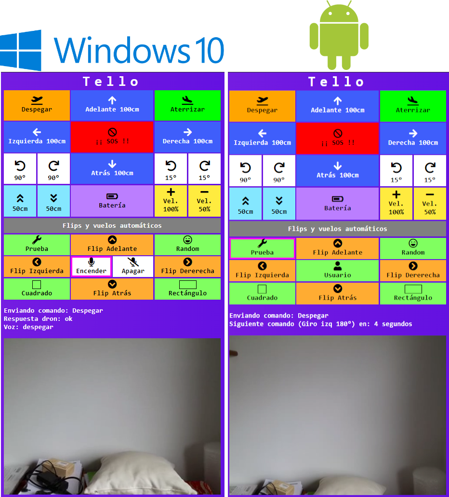

IMPORTANTE: Usa el código bajo tu propia responsabilidad.
Instalar node.js y FFmpeg (agregarlo al PATH de Windows)

# Software usado
#### Dron
* Node.js y Dgram para comunicarnos con el dron mediante paquetes UDP4.
* Socket.io: Sockets Web para enviar/recibir datos desde el navegador.
* Express y http: Creamos un servidor en socket.io.
* WebSocket: Recibir el video (dron) de http y enviarlo al cliente.
* Child_process: Crear objeto FFmpeg de forma asíncrona.

#### Navegador
* Socket.io (cliente): Sockets Web para enviar/recibir datos desde el navegador.
* FFmpeg*: Convertir el vídeo del dron.
*Importante desactivar el Firewall de Windows o crear una regla.

# Usando el código en Windows
1. Conectate al WIFI del dron manualmente
1. cd `conexionDron`
1. `npm install`
1. `npm start`
1. Ejecuta `index.html` o `indexVOZ.html` (obligatorio tener Internet). Ambos se encuentran en la carpeta `navegador`

Una vez hecho esto se puede usar el script .bat llamado `conexionDron` (cambiando name=TELLO-XXXXXX por el tuyo)

##### Comandos disponibles por voz (actualmente):
* Despegar
* Aterrizar
* Adelante
* Atrás
* Izquierda
* Derecha
* Emergencia
* Batería

# Usando el código en Android
La aplicación ha sido creada con Apache Cordova.
Instalamos Termux (emulador de linux) y a continuación Node.js y FFmpeg.

# License — WTFPL